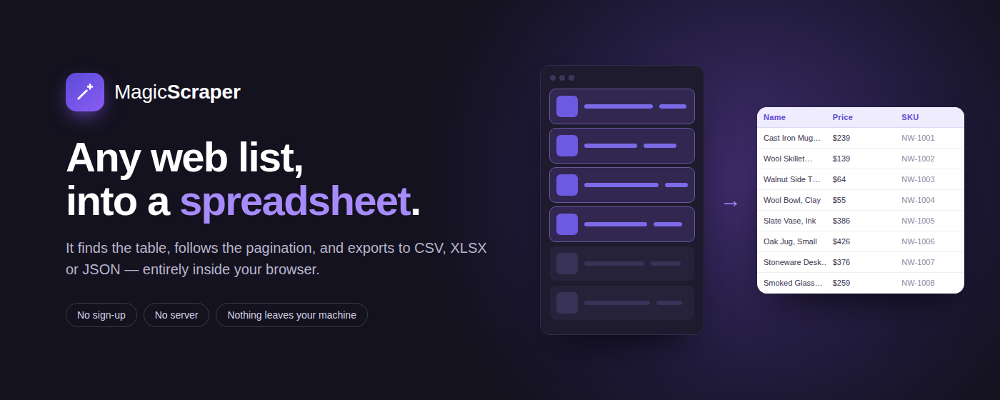
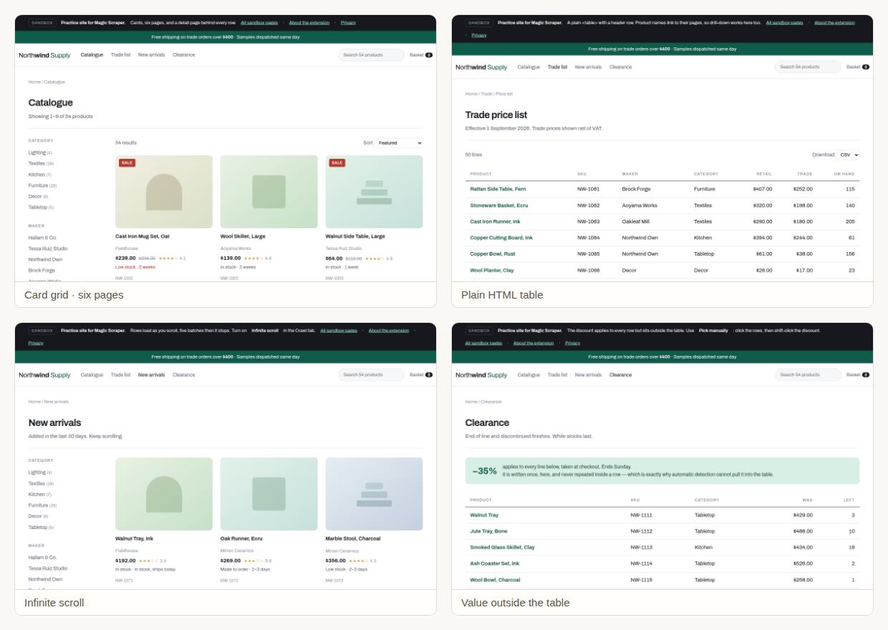
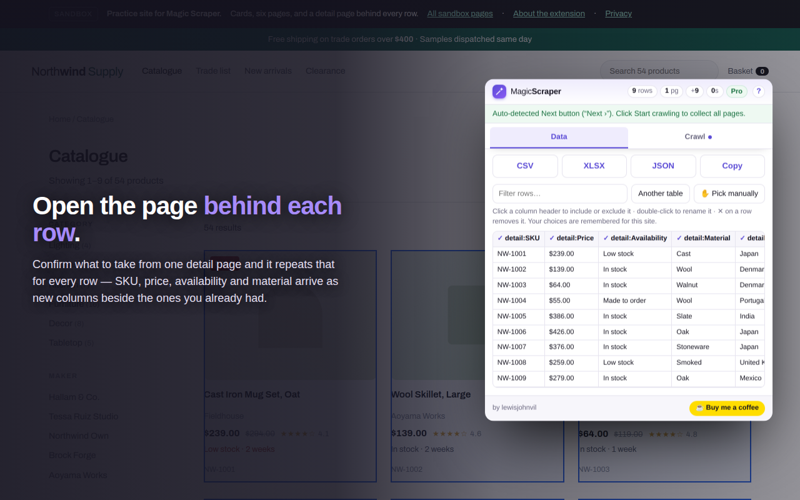

# Magic Scraper — site &amp; scrape sandbox

**[magicscraper.app](https://magicscraper.app)** — the home page for the Magic Scraper Chrome
extension, and a practice site anyone is welcome to scrape.

---

## The extension

**[Install free from the Chrome Web Store](https://chromewebstore.google.com/detail/magic-scraper/lcdaikobgjpakcgbkdedoapnckeobbck)** — works on Chrome, Edge, Brave, Opera,
Vivaldi, Arc and any other Chromium browser.

Magic Scraper finds the table or list on the page you are looking at and exports it to CSV, XLSX
or JSON. Detection, the manual picker and multi-page crawling are free; drill-down — opening the
page behind each row and merging its fields back in as extra columns — is the paid feature.

Everything runs in your browser. There is no server, no account, and nothing about the pages you
scrape is transmitted anywhere.

📄 [Privacy policy](https://magicscraper.app/privacy) · [Terms](https://magicscraper.app/terms) ·
[Support](https://magicscraper.app/support)

## The sandbox — please do scrape it

**[magicscraper.app/demo](https://magicscraper.app/demo/)** is a fictional shop, *Northwind
Supply*, built to be practised on. Nothing on it is real and nothing is rate-limited, so hammer
it as hard as you like — with this extension or any other.

It is deliberately built like a real storefront: sticky header, filter rail, rating stars, a
footer full of link lists. A scraper that only works on a page containing nothing but the table
has not been tested on anything.

| Page | What it exercises |
|---|---|
| [Catalogue](https://magicscraper.app/demo/catalogue) | Card grid, six pages of nine, a Next button |
| [Trade list](https://magicscraper.app/demo/table) | A plain `<table>` with a header row — the easy case |
| [New arrivals](https://magicscraper.app/demo/scroll) | Rows appended as you scroll, five batches then it stops |
| [Clearance](https://magicscraper.app/demo/awkward) | A discount belonging to every row but sitting outside the table |

### Three levels deep, on purpose

Behind the catalogue: 120 product pages, each linking to one of eight maker pages, each linking
to a sourcing page. One hop proves nothing about chaining, so there are three.

Every product links to its maker through an identically-labelled **"About the maker →"** rather
than the maker's name — which is how real shops label such links, and what makes a chain
confirmed on one row work on all of them.

## Bespoke scraping

Some jobs don't fit inside a browser extension: a site behind a login, one that actively fights
back, a scrape that has to run every morning without you, or the same fields pulled from thirty
competitors and reconciled into one table. We take those on as projects.

Send the site, the fields you need, how often it should run, and the budget and deadline you
have in mind, to **[support@magicscraper.app](mailto:support@magicscraper.app)** —
[more detail here](https://magicscraper.app/#bespoke). You'll get a straight answer, including
when the answer is that it can't be done lawfully or reliably.

## Support

**[support@magicscraper.app](mailto:support@magicscraper.app)** reaches someone who can actually
fix what you hit — no ticket number, no queue.

The extension is sold through [Gumroad](https://gumroad.com), who act as merchant of record. Seven-day
refund, no questions asked.

Fonts are self-hosted rather than pulled from Google — a site whose whole claim is *nothing
leaves your machine* should not make your browser phone a third party to render a headline.

## Licence

**This site and the Northwind Supply sandbox** are [Apache 2.0](LICENSE) — fork the
sandbox, use it in a tutorial, build on it. See [NOTICE](NOTICE).

**The extension itself is not open source.** It is proprietary and governed by the
[Terms](https://magicscraper.app/terms).

---

Copyright 2026 Lewis John Villamor · <a href="mailto:support@magicscraper.app">support@magicscraper.app</a>

